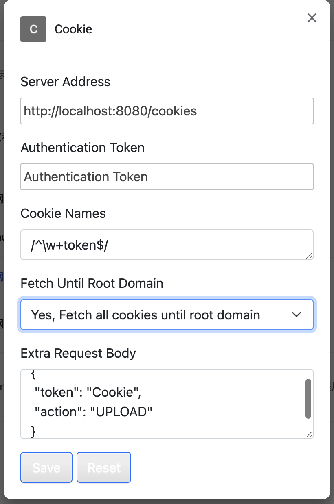

# 浏览器 Cookie 工具

访问指定的网站时获取 Cookie，发送给后端服务

## 使用场景

在工作中，经常需要一些小工具获取特定网站的数据，通过脚本访问其 API 时需要鉴权的 token，这些 token 一般都会保存在 Cookie 中；在使用时从访问的网站直接复制，写入到脚本中，但是 token
会过期，过期后需要再次手动修改； 可以通过启动一个 headless 的浏览器模拟登录获取，或者使用提供的 OAuth2 等方式获取
token，但是这种方式往往非常复杂，对于一些临时性的脚本得不偿失；还有一些网站使用非常复杂的验证码，或者每次登录都需要扫码或短信确认，很难通过模拟登录的方式获取 从浏览器获取 token
上传到指定的服务端，在使用时直接获取的方式可以绕开登录；通过浏览器插件可以实现

## 使用

#### 1. 下载项目

```bash
git clone https://github.com/helloworlde/cookie.git
```

#### 2. 安装

在 Chrome 中选择 `设置` => `扩展程序` => 打开`开发者模式` => `加载已解压的扩展程序`，选择项目目录

#### 3. 修改配置

1. 修改`有权访问的网站`

配置需要发送 Cookie 的网站，建议配置为`在特定网站上`

2. 点击扩展程序选项，修改配置



配置项：

- Server Address: 服务端保存 Cookie 的路径
- Authentication Token: 鉴权的 Token，会被添加在 Header 中，格式为 `"Authentication": "xxx"`
- Cookie Names: 要保存的 Cookie 的名称
  - 可以配置为 `*`，会将所有的 Cookie 都发送
  - 也可以配置为特定的名称，支持多个，如`SESSION_ID,userid`
  - 也可以配置为正则，会将所有满足正则的 Cookie 都发送，如 `/^\w+token$/` 会将所有以 `token`结尾的 Cookie 发送给 Server 端
- Fetch Until Root Domain: 是否查找根域名及所有子域名的 Cookie，通常子域名也会使用父域名的 Cookie，所以可以配置为 Yes，查找所有的子域名
- Extra Request Body: 附加在请求 Body 中的额外的信息；如用于 Server 端区分行为的标志等；请求 Body 默认只包含 `domain`和 `cookie`两个值，如果需要扩展，可以在这里配置一个 JSON
  对象，会在发送请求时被合并到请求 Body 中，如 `{"token": "Cookie","action": "UPLOAD"}` 最终会被合并到请求对象中

## Server 端

Server 端只需要实现保存和读取 Cookie 就可以，参考 [https://github.com/helloworlde/cos](https://github.com/helloworlde/cos)

#### 请求内容

- Header

`"Authentication": "xxx"",`

- Body

```json
  {
  "cookie": "[{\"domain\":\"github.com\",\"name\":\"dotcom_user\",\"value\":\"helloworlde\"},{\"domain\":\"github.com\",\"name\":\"logged_in\",\"value\":\"yes\"}]",
  "domain": "github.com"
}
```

如果有配置附加内容:

```json
  {
  "cookie": "[{\"domain\":\"github.com\",\"name\":\"dotcom_user\",\"value\":\"helloworlde\"},{\"domain\":\"github.com\",\"name\":\"logged_in\",\"value\":\"yes\"}]",
  "domain": "github.com",
  "token": "Cookie",
  "action": "UPLOAD"
}
```


